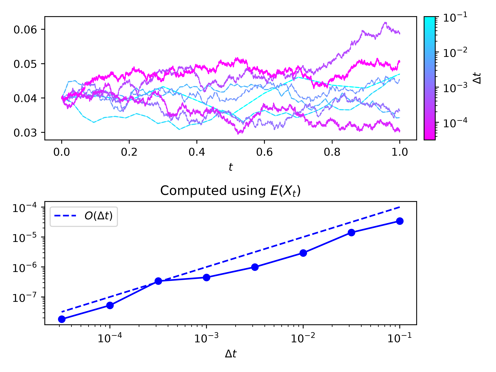
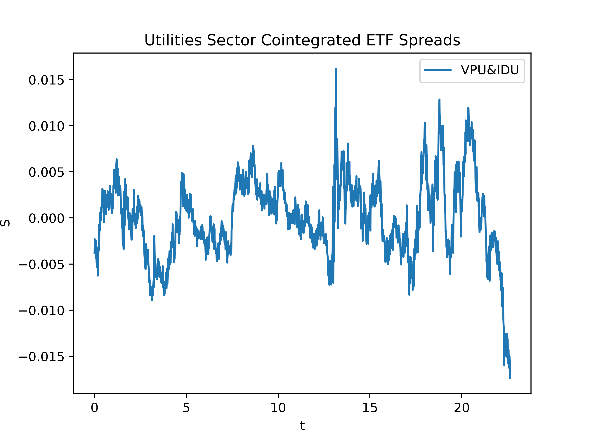

# Statistical Arbitrage via Ornstein–Uhlenbeck Mean Reversion


An independent study in **stochastic methods for quantitative finance** (UC Santa Cruz).
The project models the spread between two cointegrated assets as an Ornstein–Uhlenbeck
(OU) process, estimates its parameters from market data, and builds a trading rule that
bets on mean reversion.

---

## Overview

Two assets whose prices share a long-run equilibrium form a *cointegrated pair*. Their
spread wanders away from its mean and is pulled back, which we model with the OU SDE

$$
dX_t = \theta(\mu - X_t)\,dt + \sigma\,dW_t, \qquad \theta, \sigma > 0.
$$

The workflow is:

1. **Theory** — solve the OU SDE with Itô's lemma and derive its exact discretization.
2. **Simulation & estimation** — validate an Euler–Maruyama solver against the exact
   discretization and recover $(\theta, \mu, \sigma)$ from an AR(1) regression.
3. **Pair selection** — form log-price spreads via OLS hedge ratios and test for
   stationarity with the Augmented Dickey–Fuller test.
4. **Time-varying hedge ratio** — let the hedge ratio evolve over time.
5. **Trading rule & backtest** — out-of-sample testing with realistic transaction costs.

The goal is not a high Sharpe ratio but a rigorous, honest study: correct estimation,
out-of-sample testing, and a clear account of when the model fails.

## Project Status

| # | Problem                         | Status         |
|---|---------------------------------|----------------|
| 1 | The OU Process (theory)         | ✅ Complete     |
| 2 | Simulation and Estimation       | ✅ Complete     |
| 3 | Pair Selection and Spread       | 🚧 In progress |
| 4 | Time-Varying Hedge Ratio        | ⏳ Planned      |
| 5 | Trading Rule and Backtest       | ⏳ Planned      |

## Repository Structure

**The active code lives in [`python/`](python/).**

```
StatArb/
├── python/                         # ← active source code
│   ├── buhl.py                     # core module: SDE solver, spread fitting, OU estimation
│   ├── prob2_driver.py             # Problem 2: Euler–Maruyama convergence study
│   ├── prob3_driver.py             # Problem 3: cointegration tests on real market data
│   └── *.png                       # generated figures
├── latex/
│   ├── report.tex                  # project write-up (source)
│   └── report.pdf                  # compiled report
├── Supplemental_Reading/
│   ├── critical_values_for_cointegration_tests.pdf          # MacKinnon critical values
│   └── Pei_2019_An_elementary_introduction_to_Kalman_filtering.pdf
└── StatArb_OU_Project.pdf          # project specification
```

### Core module — [`python/buhl.py`](python/buhl.py)

| Function | Description |
|----------|-------------|
| `euler_maruyama(x, t, A, B, dt)` | One Euler–Maruyama step for $dX = A\,dt + B\,dW$; returns the new state and the Brownian increment. |
| `fit_spread(lPa, lPb)` | Fits $\log P_a = \beta \log P_b + c$ by least squares, forms the spread, and runs an ADF test (p < 0.05). Returns `(spread, hedge_ratio, is_stationary)`. |
| `fit_SDE(spread, nt, dt)` | Fits the AR(1) model $S_{n+1} = m S_n + b$ and maps it to OU parameters $(\theta, \mu, \sigma)$. |

### Drivers

- [`prob2_driver.py`](python/prob2_driver.py) — simulates the OU process with Euler–Maruyama
  and the exact discretization over a range of step sizes and plots the strong error
  convergence. Outputs `problem2.png`.
- [`prob3_driver.py`](python/prob3_driver.py) — downloads KO/PEP prices from Yahoo Finance,
  fits the spread, then scans all pairs of top utilities-sector ETFs for cointegration.
  Outputs `problem3.png` and `problem3_etf_spreads.png`.

## Dependencies

**Python 3.9+** with:

| Package | Used for |
|---------|----------|
| [`numpy`](https://numpy.org/) | arrays, least squares, random numbers |
| [`matplotlib`](https://matplotlib.org/) | figures |
| [`statsmodels`](https://www.statsmodels.org/) | Augmented Dickey–Fuller test (`adfuller`) |
| [`yfinance`](https://github.com/ranaroussi/yfinance) | historical market data from Yahoo Finance |

To build the report: a LaTeX distribution (e.g. TeX Live) with `latexmk`.

## Getting Started

```bash
# clone the repository
git clone git@github.com:dbuhl8/StatArb.git
cd StatArb

# (optional) create a virtual environment
python -m venv .venv
source .venv/bin/activate

# install dependencies
pip install numpy matplotlib statsmodels yfinance
```

Run the drivers from inside `python/` (they import `buhl` and write figures to the
current directory):

```bash
cd python
python prob2_driver.py    # Euler–Maruyama convergence study
python prob3_driver.py    # cointegration analysis (requires internet access)
```

Build the report:

```bash
cd latex
latexmk -pdf report.tex
```

## Results

**Euler–Maruyama vs. exact discretization** — sample paths across step sizes (top) and
strong-error convergence (bottom).

<p align="center">
  
</p>

**Cointegrated utilities-sector ETF spreads** — pairs passing the ADF test.

<p align="center">
  
</p>

See [`latex/report.pdf`](latex/report.pdf) for the full write-up.

## References

- A. Papanicolaou, *Introduction to Stochastic Differential Equations (SDEs) for Finance*,
  [arXiv:1504.05309](https://arxiv.org/abs/1504.05309).
- J. G. MacKinnon, *Critical Values for Cointegration Tests*
  ([PDF](Supplemental_Reading/critical_values_for_cointegration_tests.pdf)).
- Y. Pei et al., *An Elementary Introduction to Kalman Filtering* (2019)
  ([PDF](Supplemental_Reading/Pei_2019_An_elementary_introduction_to_Kalman_filtering.pdf)) —
  background for the time-varying hedge ratio (Problem 4).
- [`statsmodels.tsa.stattools.adfuller`](https://www.statsmodels.org/stable/generated/statsmodels.tsa.stattools.adfuller.html)

## Author

**Dante Buhl** — University of California, Santa Cruz
